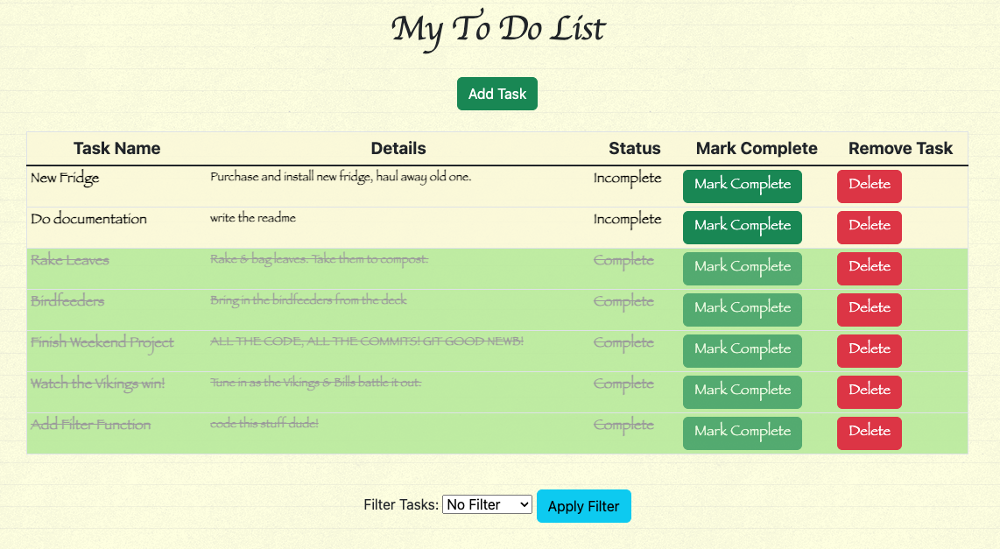

# Weekend SQL To Do List

## Description

This to-do list is styled as if taken on notepad paper and features the ability to add tasks, mark them as complete, delete tasks and filter them by their completion status. This allows the checklist user to stay on top of their responsibilities with just a few clicks. 
Completed tasks will have a green background with faded text that has been crossed out to easily identify which tasks are already done.

## Sample image

## Installation

1. Fork and clone this repository.
2. Create a database named "weekend-to-do-app".
3. Run the SQL queries in the database.sql file to set up a table and populate it. This project was made with Postgres and Postico and will work nicely with that duo.
4. From your terminal run 'npm install'.
5. Then run 'npm start' to spin up your local server.
6. Navigate out to http://localhost:5000/ to begin using the application.